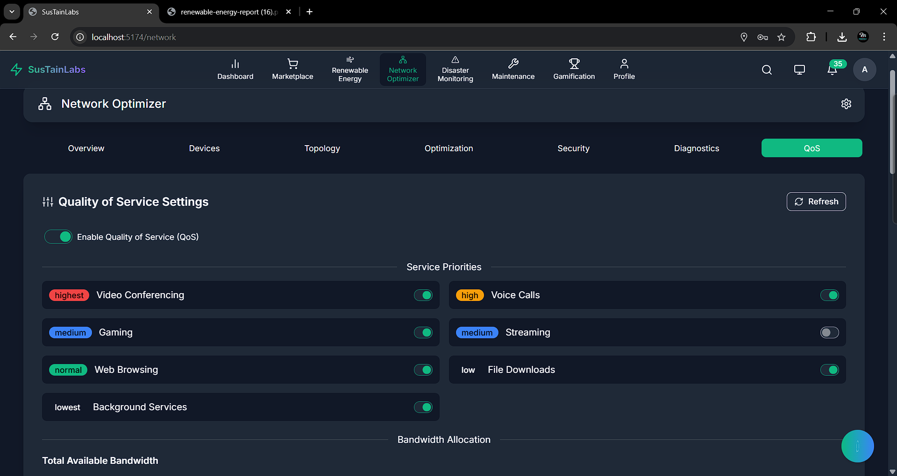
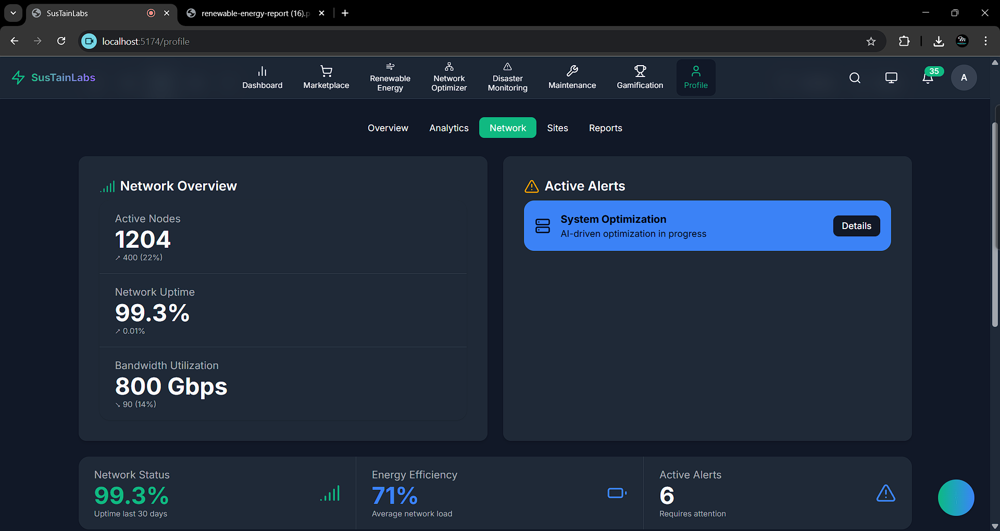

# 🌟 SustainLABs - Revolutionizing Renewable Energy Management
# Demo Link: https://sustainlab.netlify.app/
# Demo Video: https://youtu.be/zWY7RrNaMm4
> **Transforming fragmented energy systems into unified, efficient, and trustworthy sustainable solutions**

<div align="center">
  

  [](https://www.typescriptlang.org/)
  [](https://reactjs.org/)
  [](https://www.python.org/)
  [](https://www.tensorflow.org/)
  [](https://ethereum.org/)
</div>

---

## 📌 Problem Statement

**❗ Problem Statement**  
The adoption of renewable energy is hindered by five major challenges: system fragmentation, inefficiency, consumer distrust, reactive maintenance, and disaster vulnerability. These issues lead to higher operational costs, wasted energy potential, and unreliable infrastructure—especially in rural areas where sustainable development is most needed. There is an urgent need for an integrated, intelligent platform that ensures efficient, transparent, and resilient energy management.

---

## 🎯 Objective

SustainLABs tackles the five critical bottlenecks in renewable energy adoption: fragmentation, inefficiency, lack of trust, reactive maintenance, and disaster vulnerability.

The renewable sector suffers from disconnected systems and data silos that increase operational costs by 40%. Nearly 80% of installations operate below optimal efficiency, wasting 12-27% of potential savings without real-time AI insights. Consumer distrust runs high, with 43% skeptical of green energy claims. Reactive maintenance leads to costly downtime—wind turbine failures average $240,000 per incident.

Our platform unifies renewable energy management with AI-powered insights, blockchain-verified transactions, and predictive maintenance to create resilient, efficient energy systems that accelerate rural economic development through sustainable practices.

---

## 🧠 Team & Approach

### Team Name:  
`Spider`

### Our Approach:  
- We chose this problem because fragmented renewable energy systems limit rural economic development
- We overcame data synchronization challenges using edge computing and Merkle tree verification
- Our breakthrough came when integrating Groq's LPU technology for real-time AI optimization

---

## 🛠️ Tech Stack

<div align="center">
  
</div>

### Core Technologies Used:
- **Frontend**: React, TypeScript, Framer Motion, Recharts
- **Backend**: Python, Node.js, Express, Socket.IO
- **Database**: Supabase, MongoDB, TimescaleDB
- **AI**: TensorFlow, Google Generative AI, Python ML Libraries
- **Hosting**: AWS, Vercel

### Sponsor Technologies Used:
- ✅ **Groq:** Real-time AI processing for energy optimization using LPU acceleration  
- ✅ **Monad:** High-throughput blockchain for processing massive IoT sensor data  
- ✅ **InfinyOn/Fluvio:** Real-time data streaming for continuous energy analytics  
- ✅ **Base:** AgentKit for autonomous energy trading and smart wallet integration  
- ✅ **Screenpipe:** Advanced visual processing for energy system monitoring  
- ✅ **Stellar:** Cross-border renewable energy certificate trading and payments  

---

## ✨ Key Features

<div style="display: flex; justify-content: space-between; flex-wrap: wrap; gap: 20px; margin-bottom: 30px;">
  <div style="width: 48%;">
    <h3>🔍 Interactive Energy Dashboard</h3>
    
    <p>Comprehensive monitoring with real-time visualization of energy flows, production statistics, and consumption patterns.</p>
  </div>
  <div style="width: 48%;">
    <h3>🧠 AI-Powered Recommendations</h3>
    
    <p>Smart optimization suggestions based on usage patterns with predictive maintenance alerts.</p>
  </div>
</div>

<div style="display: flex; justify-content: space-between; flex-wrap: wrap; gap: 20px; margin-bottom: 30px;">
  <div style="width: 48%;">
    <h3>⛓️ Blockchain Integration</h3>
    
    <p>Decentralized energy trading via smart contracts with transparent verification.</p>
  </div>
  <div style="width: 48%;">
    <h3>📊 Advanced Monitoring</h3>
    
    <p>Equipment health tracking and maintenance scheduling with real-time alerts.</p>
  </div>
</div>

<div style="display: flex; justify-content: space-between; flex-wrap: wrap; gap: 20px; margin-bottom: 30px;">
  <div style="width: 48%;">
    <h3>🌩️ Disaster Response</h3>
    
    <p>Immutable record of disaster events with decentralized alert system for rapid response.</p>
  </div>
  <div style="width: 48%;">
    <h3>💓 Health Monitoring</h3>
    
    <p>Smartphone-based health tracking without energy-draining wearables.</p>
  </div>
</div>

---

## 🖥️ Interactive User Interface

<div align="center">
  <h3>Command Center Overview</h3>
  
</div>

<div style="display: flex; justify-content: space-between; gap: 20px; margin-bottom: 30px;">
  <div style="width: 48%;">
    <h3>Energy Production Analytics</h3>
    
  </div>
  <div style="width: 48%;">
    <h3>Consumption Heatmap</h3>
    
  </div>
</div>

<div style="display: flex; justify-content: space-between; gap: 20px; margin-bottom: 30px;">
  <div style="width: 48%;">
    <h3>Weather Impact Analysis</h3>
    
  </div>
  <div style="width: 48%;">
    <h3>Network Visualization</h3>
    
  </div>
</div>

---

## 🧠 AI & Predictive Analytics

<div style="display: flex; justify-content: space-between; flex-wrap: wrap; gap: 20px;">
  <div style="width: 48%;">
    <h3>Predictive Maintenance</h3>
    
    <p>Anticipate equipment failures before they occur, reducing downtime by 73%.</p>
  </div>
  <div style="width: 48%;">
    <h3>AI Recommendations</h3>
    
    <p>Smart optimization suggestions that reduce energy costs by up to 31%.</p>
  </div>
</div>

---

## ⛓️ Multi-Chain Integration

<div align="center">
  
</div>

---

## 🧪 How to Run the Project

### Requirements:
- Node.js v18+ / Python 3.10+  
- MongoDB database  
- Blockchain wallet connections  
- Environment variables (see `.env.example`)  

### Local Setup:
```bash
git clone https://github.com/Ayushdevx/SustainLABs
cd SustainLABs
npm install
cp .env.example .env
```
# edit .env with your values
npm run dev
Backend:
```
bash
Copy
Edit
cd backend
pip install -r requirements.txt
python manage.py runserver
```
📚 Learning & Development
<div style="display: flex; flex-wrap: wrap; gap: 20px;"> <div style="width: 48%;">  <p>Interactive learning dashboard</p> </div> <div style="width: 48%;">  <p>Structured learning paths for energy skills</p> </div> </div>

 <p style="margin-top: 40px; color: #666; font-style: italic;">Built with 💚 by Team SPIDER</p> </div>
