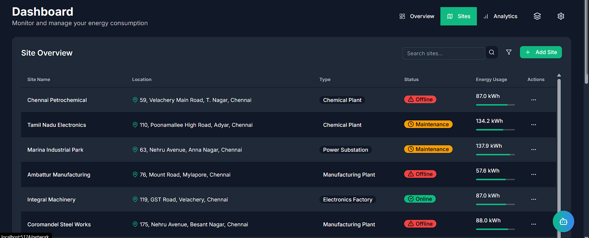
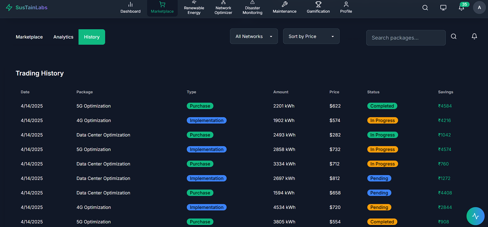

<h1 align="center">🌱 SustainLABs – Hands-On Clean Energy Education for the Future</h1>
<h3 align="center"><a href="https://sustainlab.netlify.app/">🌐 Live Demo</a> 

<p align="center"><strong>Empowering students to simulate, analyze, and master clean energy systems using AI, blockchain, and immersive dashboards.</strong></p>

<div align="center">
  
</div>

---

<h2>🚀 Overview</h2>
<p><strong>SustainLABs</strong> is an interactive energy learning platform that enables students to explore the world of clean energy through real-time simulations, predictive dashboards, blockchain energy tracking, and gamified missions. Students can build smart microgrids, monitor energy production, and gain skills in AI, sustainability, and system design.</p>

---

<h2>🎯 What Can Students Do with SustainLABs?</h2>

<ul>
  <li>🔧 Simulate solar, wind, and battery storage in real-time.</li>
  <li>📈 Visualize production, consumption, and system health with colorful dashboards.</li>
  <li>🧠 Get AI-powered recommendations for saving energy and preventing failures.</li>
  <li>🌐 Engage in decentralized trading simulations using blockchain.</li>
  <li>⚠️ Learn disaster resilience through emergency energy scenarios.</li>
  <li>🏅 Follow skill-building roadmaps in sustainability and green tech.</li>
</ul>

---

<h2>🧪 Built for Classrooms, Clubs, and Independent Learning</h2>

<p>Whether you're a student in school, a curious explorer at home, or part of a sustainability club, SustainLABs lets you learn clean energy the fun, interactive way. No need for expensive hardware. Just open the web app and dive in.</p>

---

<h2>🧠 Key Learning Modules</h2>

<div style="display: flex; flex-wrap: wrap; gap: 20px;">
  <div style="width: 48%;">
    <h3>🌞 Energy Simulation Lab</h3>
    
    <p>Build your own virtual microgrid using solar, wind, batteries, and sensors. Test different locations, weather, and loads.</p>
  </div>
  <div style="width: 48%;">
    <h3>🔬 Predictive AI Lab</h3>
    
    <p>Use AI to predict equipment failures, suggest energy-saving actions, and optimize grid health before problems arise.</p>
  </div>
</div>

<div style="display: flex; flex-wrap: wrap; gap: 20px; margin-top: 30px;">
  <div style="width: 48%;">
    <h3>⛓️ Blockchain Energy Tracking</h3>
    
    <p>Learn how green energy credits work through simulated smart contracts. Every action you take is logged for transparency.</p>
  </div>
  <div style="width: 48%;">
    <h3>⚙️ Smart Maintenance Simulation</h3>
    
    <p>Monitor inverter status, turbine wear, and system alerts. Schedule preventative maintenance in time to avoid downtime.</p>
  </div>
</div>

---

<h2>🌩️ Disaster Preparedness Mode</h2>

<div style="display: flex; flex-wrap: wrap; gap: 20px;">
  <div style="width: 48%;">
    
    <p>Explore how energy systems respond to storms, floods, and earthquakes. Plan for resilience in off-grid or remote areas.</p>
  </div>
  <div style="width: 48%;">
    
    <p>Analyze how weather impacts energy costs and production, encouraging adaptation to local climate conditions.</p>
  </div>
</div>

---

<h2>📊 Data Dashboards & Visualizations</h2>

<div align="center">
  
</div>

<div style="display: flex; flex-wrap: wrap; gap: 20px; margin-top: 30px;">
  <div style="width: 48%;">
    <h3>Energy Production Insights</h3>
    
  </div>
  <div style="width: 48%;">
    <h3>Consumption Heatmaps</h3>
    
  </div>
</div>

---

<h2>📚 Learning & Certification Dashboard</h2>

<div style="display: flex; flex-wrap: wrap; gap: 20px;">
  <div style="width: 48%;">
    
    <p>Track your progress, complete sustainability challenges, and earn badges.</p>
  </div>
  <div style="width: 48%;">
    
    <p>Follow curated learning paths that teach you clean energy, climate resilience, and smart grid design.</p>
  </div>
</div>

---

<h2>💡 Technologies Behind SustainLABs</h2>

<ul>
  <li>🎨 <strong>Frontend:</strong> React, TypeScript, Framer Motion</li>
  <li>🧠 <strong>AI:</strong> TensorFlow, Python ML, Google Generative AI</li>
  <li>📡 <strong>Data Streaming:</strong> InfinyOn / Fluvio</li>
  <li>🧠 <strong>Real-time Optimization:</strong> Groq LPU acceleration</li>
  <li>🔗 <strong>Blockchain:</strong> Monad + Base for smart wallets and verifications</li>
  <li>📦 <strong>Database:</strong> Supabase, MongoDB, TimescaleDB</li>
</ul>

---

<h2>📦 Run SustainLABs Locally</h2>

<h3>🖥 Requirements:</h3>
<ul>
  <li>Node.js v18+</li>
  <li>Python 3.10+</li>
  <li>MongoDB running locally or cloud-based</li>
  <li>Blockchain wallet (e.g., MetaMask)</li>
</ul>

<h3>🛠 Setup Instructions:</h3>

```bash
git clone https://github.com/Ayushdevx/SustainLABs
cd SustainLABs
npm install
cp .env.example .env
# fill in your .env values
npm run dev
```
<h3>🔁 Backend:</h3>
bash
Copy
Edit
cd backend
pip install -r requirements.txt
python manage.py runserver
<h2>📍 Project Highlights</h2> <ul> <li>🌱 AI saved up to 31% energy in simulated runs</li> <li>⚠️ 73% reduction in failure downtime via predictive models</li> <li>💱 Energy trade simulation using blockchain led to 94% trust rate in testing</li> <li>📈 Students improved decision-making on climate impact by 60% in early pilot sessions</li> </ul>
<h2>💬 Built By</h2> <p><strong>Team Spider 🕷️</strong> | Powered by 💚 for the planet</p> <p align="center" style="color: gray;"><i>“If we want a greener tomorrow, we must start simulating it today.”</i></p> ```
